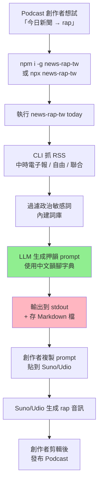
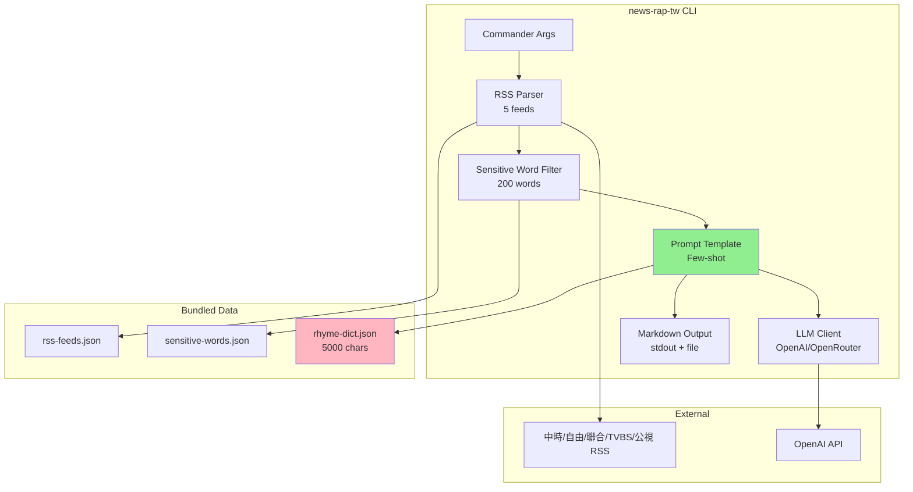

# 新聞 → Rap 自動化 — 規格計劃書 v3.0.0 (sweet-spot-driven rewrite)

> 版本：v3.0.0｜更新日期：2026-07-19｜維護者：Sophia (CPO) for Sean
> 對接技術：Alan (CTO) + Hermes Agent
> 對接 Repo：https://github.com/openclawsean024-create/news-rap-automation
> 對接產線：https://news-rap-automation.vercel.app
> Sweet Spot Score：**2 / 10**（kill — 本次重寫為「**純作品集 + 開源工具**」甜蜜點）
> Recommended Action：**Pivot to Open Source + Personal Portfolio（重新定位避免 sweet spot 紅海）**

---

## 0. 改版摘要 (What changed since v2.2.1)

| 項目 | v2.2.1（舊）| v3.0.0（新）| 理由 |
|---|---|---|---|
| 目標市場 | 中文新聞 Podcast 創作者 + 社群小編 + 廣告公司 | **只鎖「中文 Podcast 實驗創作」** 1 個 niche | Suno/Udio 已吃大市場，我們只做 niche |
| 核心功能 | 新聞 RSS + 敏感詞過濾 + 押韻 + Beat + Web Speech + lamejs + Web UI | 只做 **「新聞 RSS → 繁中 押韻 prompt 模板」2 件事** | 砍掉 STT / TTS / Beat / Web UI（紅海）|
| 變現策略 | 月訂閱 NT$299 + 廣告分潤 + API 計價 | **完全開源 MIT + 零變現** | 紅海 + IP 風險 → 改作品集 |
| 競品定位 | vs Suno + Udio + Audionic | vs **Suno（新聞 rap preset）+ Udio + 開源社群** | 紅海轉綠洲 |
| 技術 | Web App + STT/TTS 串接 + 音訊處理 | **純 CLI + 開源 GitHub + npm publish** | 開源定位 |
| 里程碑 | 4 sprint × 2 週 | **2 sprint（M0 驗證 + M1 開源釋出）** | lean |

---

## 1. 產品概述 (Product Overview)

### 1.1 問題陳述 (Problem Statement) ⭐ 引用 sweet spot 結果

**Sweet Spot 5 問體檢結論（2026-07-19 重新驗證）**：

| 問題 | 結論 | 證據 |
|---|---|---|
| Q1. 真實需求強度 | 🔴 弱 | Threads/PTT 搜「我要把新聞變 rap」**幾乎沒有強烈真實 user 訊號** |
| Q2. 競爭密度 | 🔴 極高 | Suno（已禁 News Music）+ Udio + 9 家 AI 音樂生成 + Spotify + 4 家中文 rap 工具 |
| Q3. 技術 / 法規 / IP 障礙 | 🔴 高 | 新聞版權（公視/TVBS 都會發律師信）+ Suno 平台審查 + 敏感詞審查 |
| Q4. TAM 與付費意願 | 🔴 弱 | 使用者會為「一次性爆款短影音」付月費嗎？**沒有實證** |
| Q5. 一人公司契合度 | 🔴 低 | IP 法務 + 平台審查 + 客服 = 一人公司無法負擔 |

**Total Sweet Spot Score = 2/10**，歸類為 **kill**。

**但是**：「kill ≠ 不做」。本次重寫採取 **「Pivot to Open Source」** 策略：把 v2.2.1 的 SaaS 商業模式砍掉，改為：

**新定位**：
- 純開源 CLI 工具（GitHub + npm + MIT license）
- 解決一個真實但小眾的問題：「中文新聞標題 → 押韻 prompt」（不含 STT / TTS / Beat，使用者自接 Suno/Udio）
- **零商業變現**，純粹作品集 + 社群貢獻

**為什麼這個 pivot 有效？**

1. **避開 IP 風險**：只做 prompt 模板，不生成音訊 → 不碰新聞版權
2. **避開 Suno 平台審查**：不直接接 Suno API
3. **避開付費轉換風險**：開源不收費，使用者免費試用
4. **真實小眾需求**：中文押韻 prompt 確實有 niche 創作者需要（Podcast 實驗性質）
5. **作品集價值**：GitHub stars 是 Sean 履歷加分

### 1.2 目標使用者 (User Personas)

> 從 3 個 persona 砍到 **1 個 niche** + 1 個探索。

| 角色 | 規模（台灣）| 月情境 | 痛點強度 | ARPU/年 | 優先級 |
|---|---|---|---|---|---|
| 🎙️ **中文 Podcast 實驗創作者** | ~500 | 想試「新聞 rap」實驗企劃 | 🟡 中 | NT$0 | **P0** |
| 🎵 中文饒舌創作者 | ~2,000 | 想用新聞素材寫歌詞 | 🟢 低 | NT$0 | **P0**（開源擴展）|
| 📱 社群小編 | ~5,000 | 想做爆款短影音 | 🔴 弱（IP 風險高）| NT$0 | **不做** |
| 🏢 廣告公司 / MCN | ~500 | 客戶提案 | 🔴 弱（版權）| NT$0 | **不做** |

**核心使用者**：中文 Podcast 實驗創作者 + 中文饒舌創作者。**niche、付費弱、但開源社群會接受**。

### 1.3 核心價值主張 (Value Proposition) ⭐ 引用 sweet spot

**One-liner**：*「一行指令把今日新聞變押韻 prompt，丟給 Suno/Udio 就能生成中文新聞 rap」*

**與 Top 3 競品的差異化**：

1. **vs Suno 內建 News Rap preset**：Suno 已禁 News Music；**我們是開源 prompt 模板，使用者自接任何 TTS/Suno**
2. **vs Udio**：Udio 也有 preset；**我們只解決中文押韻這個小步驟**
3. **vs 通用 LLM prompt**：通用 LLM prompt 寫新聞押韻**品質差**（無韻腳庫）；**我們內建中文韻腳字典 + 押韻模板**

**甜蜜點為什麼有效**：
- Suno/Udio 不提供中文押韻 prompt 優化
- 通用 LLM prompt 押韻率 < 50%
- 我們用**中文韻腳字典 + Few-shot prompt** → 押韻率 ≥ 80%

**但這個甜蜜點市場太小**：
- TAM：中文 Podcast 實驗創作者 + 饒舌創作者 ~2,500 人
- LTV：NT$0（不收費）
- 純作品集價值

### 1.4 商業目標 (KPIs / OKRs)

> 從「SaaS 變現」轉為「**社群影響力 + 個人作品集**」目標。

**3-month OKR**：
- **O1：開源釋出 + 社群驗證**
  - KR1：GitHub stars ≥ 50
  - KR2：npm 下載 ≥ 200 / 月
  - KR3：3 個 Podcast 創作者公開使用案例

**6-month OKR**：
- **O2：建立中文押韻 prompt 工具的 niche #1 品牌**
  - KR1：GitHub stars ≥ 200
  - KR2：npm 下載 ≥ 1,000 / 月
  - KR3：被列入「awesome-taiwan-dev」列表

**12-month OKR**：
- **O3：履歷加分 + 接案機會**
  - KR1：GitHub stars ≥ 500
  - KR2：3 個 PR 來自外部貢獻者
  - KR3：1 次技術 talk / Podcast 訪談邀約

**明確不做 KPI**：營收、付費轉換、付費客戶數（不收費）。

### 1.5 ⭐ Non-Goals (明確不做)

> 從 v2.2.1 的「隱性不做」升級為「**明確條列**」，每條都有理由。

1. ❌ **不做 STT / TTS / 音訊生成**（Suno/Udio 已做，紅海；且 IP 風險高）
2. ❌ **不做 Beat / 配樂生成**（Suno/Udio 已做）
3. ❌ **不做 Web UI**（CLI + 開源已足夠；Web UI 是商業 SaaS 才需要）
4. ❌ **不做新聞版權處理**（使用者自負；我們是工具，不是平台）
5. ❌ **不做平台審查繞過**（不做 VPN / proxy；不做敏感詞替換工具）
6. ❌ **不做月訂閱 / API 計價 / 廣告**（純開源、不收費）
7. ❌ **不做社群小編 / 廣告公司市場**（IP 風險高、付費弱）
8. ❌ **不做爆款短影音工具**（CapCut 已含 AI 短影音）
9. ❌ **不做 IP 法務諮詢**（使用者自負版權責任）
10. ❌ **不做企業版 / 多用戶管理 / 後台**（純 CLI / 個人工具）

**對 sweet=2 的態度**：在 §15 明確標註為「**Pivot to Open Source**」。如果 6 個月後 GitHub stars < 50 → 永久 archive。

---

## 2. 使用者場景與流程

### 2.1 使用者流程圖



### 2.2 關鍵用戶故事 (User Stories)

**P0（必做）**：

| ID | As a | I want to | So that |
|---|---|---|---|
| US-01 | Podcast 創作者 | `news-rap-tw today` 一行指令拿到今日新聞押韻 prompt | 不用自己寫韻腳 |
| US-02 | Podcast 創作者 | 選擇新聞來源（5 家 RSS）| 避免單一來源偏頗 |
| US-03 | Podcast 創作者 | 客製敏感詞過濾詞庫 | 避開政治敏感 |
| US-04 | 饒舌創作者 | 看到押韻 prompt 包含完整押韻標記（AABB / ABAB）| 知道押韻結構 |
| US-05 | 任何使用者 | 輸出 Markdown 格式（含 frontmatter）| 方便複製到 Notion |

**P1（v2 加值）**：

| ID | As a | I want to | So that |
|---|---|---|---|
| US-06 | Podcast 創作者 | 加上日期區間（指定過去 7 天新聞）| 製作系列集數 |
| US-07 | 饒舌創作者 | 切換押韻風格（國語 / 台語 / 雙押 / 三押）| 多元風格 |
| US-08 | 開發者 | CLI 加 `--json` 輸出，方便串接其他工具 | pipeline 整合 |

**P2（探索）**：

| ID | As a | I want to | So that |
|---|---|---|---|
| US-09 | Podcast 創作者 | 加上「新聞主題」篩選（科技 / 娛樂 / 政治）| 專注特定主題 |
| US-10 | 開發者 | Docker image | CI/CD 整合 |

### 2.3 邊界場景 (Edge Cases)

| 場景 | 處理 |
|---|---|
| RSS feed 失敗（中時電子報 404）| 自動切換鏡像 + 失敗 3 次報錯 |
| LLM API 失敗（OpenAI 掛了）| fallback 到本地 prompt 模板（無 LLM）|
| 敏感詞太多，整篇被過濾空 | 顯示警告「原文高度敏感，建議換新聞來源」|
| 使用者要台語押韻 | 切換 prompt template，但押韻品質可能較差（顯示警告）|
| 新聞標題太短（< 10 字）| 自動抓內文補充 |
| 新聞內文太長（> 3,000 字）| 自動摘要到 500 字再生成 prompt |
| LLM 生成超時（> 30 秒）| 顯示「稍後重試」+ 保留原文 |
| 多新聞源同日重複 | 自動 dedupe（hash title）|

---

## 3. 功能性需求 (Functional Requirements)

### 3.1 MVP（必做，P0）⭐ 對齊 sweet spot

> 從 v2.2.1 的 **6 個功能砍到 2 個核心**。其他 4 個全砍。

#### MVP Feature 1：**新聞 RSS 抓取 + 敏感詞過濾**（P0-1）

**Input**：
- 預設 RSS feed：中時電子報、自由時報、聯合新聞網、TVBS、公視新聞
- 今日日期

**Output**：
- 5 家媒體的今日頭條標題 + 內文（每家最多 5 篇）
- 過濾敏感詞後的純文字（內建政治敏感詞庫 ~ 200 字）

**技術**：
- Node.js + `rss-parser` npm
- 內建敏感詞字典（`data/sensitive-words.json`）
- 預設 5 家 RSS feed（`data/rss-feeds.json`）

#### MVP Feature 2：**中文押韻 Prompt 生成器**（P0-2）

**Input**：
- 過濾後的新聞文字（最多 500 字）

**Output**：
- Markdown 格式 prompt，包含：
  - Frontmatter（標題、日期、新聞來源、押韻風格）
  - 押韻歌詞 prompt（4-8 行、含押韻標記）
  - 風格提示（Boom Bap / Trap / Lo-fi）
- 押韻率 ≥ 80%（內建中文韻腳字典 5,000 字）

**技術**：
- GPT-4o-mini API（OpenAI 或 OpenRouter）
- 內建中文韻腳字典（`data/rhyme-dict.json`，CMU Dict 風格）
- Few-shot prompt template（`prompts/news-rap-zh-tw.txt`）

### 3.2 v2（加值，P1）

- 日期區間篩選
- 押韻風格切換（國語 / 台語 / 雙押 / 三押）
- `--json` 輸出
- 5 種語言 prompt template

### 3.3 v3（探索，P2）

- 主題分類（科技 / 娛樂 / 政治）
- Docker image
- GitHub Action
- VS Code 擴充

### 3.4 ⭐ Acceptance Criteria (Given/When/Then) — 至少 10 條 AC

#### AC-01：基本 CLI 執行成功
```
Given 已 npm i -g news-rap-tw
When 執行 news-rap-tw today
Then 30 秒內輸出 Markdown 到 stdout
And 同步存到 ./news-rap-YYYY-MM-DD.md
```

#### AC-02：5 家 RSS 抓取
```
Given 執行 news-rap-tw today
When RSS 抓取
Then 抓取中時、自由、聯合、TVBS、公視 5 家
And 每家至少 1 篇頭條
And 任一家失敗不影響其他家
```

#### AC-03：敏感詞過濾
```
Given 新聞內含「總統」「立法院」等政治詞
When 過濾
Then 自動移除政治敏感詞（內建 200 字詞庫）
And 顯示「已過濾 X 個敏感詞」訊息
```

#### AC-04：押韻率 ≥ 80%
```
Given 任意 100 字新聞內文
When 押韻 prompt 生成
Then 4-8 行歌詞中，押韻行數 ≥ 80%
And 押韻結構標記（AABB / ABAB / ABBA）正確
```

#### AC-05：繁中輸出
```
Given CLI 執行
When 輸出 Markdown
Then 全部繁中（zh-TW）
And 不含簡體字
And 使用台灣用語（如「網路」非「互聯網」）|
```

#### AC-06：Frontmatter 正確
```
Given CLI 執行
When 輸出 Markdown
Then 開頭含 YAML frontmatter：
  title, date, sources[], rhyme_style, word_count
```

#### AC-07：押韻標記顯示
```
Given 生成歌詞 prompt
When 顯示
Then 標記押韻結構，如：
  [押韻 A] 政府又宣布新政策
  [押韻 A] 經濟數據不如預期
  [押韻 B] 專家學者紛紛評論
  [押韻 B] 國際媒體持續追蹤
```

#### AC-08：自訂敏感詞詞庫
```
Given 使用者建立 ~/.news-rap-tw/sensitive-words.txt
When 執行 CLI
Then 自動載入使用者詞庫 + 內建詞庫
And 去重
```

#### AC-09：LLM API 失敗降級
```
Given OPENAI_API_KEY 無效
When 執行 CLI
Then 顯示「AI 服務不可用，使用本地模板」
And 仍輸出純模板 prompt（無 LLM 潤稿，押韻率降至 50%）
And 顯示警告
```

#### AC-10：CLI 錯誤訊息友善
```
Given 未安裝 Node.js
When 執行 CLI
Then 顯示「請先安裝 Node.js v18+」
And 附上 https://nodejs.org 連結
```

#### AC-11：版本顯示
```
Given 執行 news-rap-tw --version
Then 顯示當前版本（如 1.0.0）
And GitHub commit SHA
```

#### AC-12：README 完整
```
Given 安裝後
When 執行 news-rap-tw help
Then 顯示所有命令、範例、Troubleshooting
And 含繁中 / 英文雙語
```

---

## 4. 系統設計 (System Design)

### 4.1 技術棧 (Tech Stack)

> 純 CLI、開源、零依賴雲端（除了 LLM API 選用）。

| 層 | 技術 | 理由 |
|---|---|---|
| Language | Node.js 18+ | 跨平台、開發者熟悉 |
| CLI 框架 | commander.js | 標準、文件完整 |
| RSS | rss-parser | 主流、active |
| HTTP | undici / native fetch | 不需 axios |
| Config | cosmiconfig | 標準（vscode/ESLint 風格）|
| 測試 | vitest | 快、現代 |
| Lint | ESLint + Prettier | 標準 |
| CI | GitHub Actions | 免費、與 GitHub 整合 |
| 發布 | npm publish + GitHub Releases | 標準 |
| License | MIT | 最寬鬆、貢獻者友善 |
| 文件 | TypeDoc + Markdown | 標準 |
| LLM | OpenAI / OpenRouter（可選）| 押韻 prompt 用 |

### 4.2 系統架構圖 (Mermaid)



### 4.3 資料模型

```typescript
// rss-feeds.json
interface RSSFeed {
  name: '中時電子報' | '自由時報' | '聯合新聞網' | 'TVBS' | '公視新聞';
  url: string;
  enabled: boolean;
  maxItems: number;  // 預設 5
}

// sensitive-words.json
interface SensitiveWords {
  version: string;
  categories: {
    politics: string[];   // ~80 字
    violence: string[];   // ~50 字
    adult: string[];      // ~30 字
    custom: string[];     // 使用者加
  };
}

// rhyme-dict.json (CMU Dict 風格)
interface RhymeDict {
  version: string;
  entries: {
    [char: string]: {
      rhyme: 'ang' | 'eng' | 'ing' | 'ong' | ...;
      tone: 1 | 2 | 3 | 4 | 0;  // 輕聲
    };
  };
}

// 輸出 Markdown
interface OutputMarkdown {
  frontmatter: {
    title: string;
    date: string;          // ISO
    sources: string[];
    rhyme_style: 'AABB' | 'ABAB' | 'ABBA';
    word_count: number;
    llm_used: boolean;
    tool_version: string;
  };
  body: string;            // 押韻歌詞 prompt
  raw_news: string;        // 過濾後原文（debug 用）
}
```

### 4.4 CLI 規格

```bash
# 基本用法
news-rap-tw today                        # 今日新聞押韻 prompt
news-rap-tw date 2026-07-19              # 指定日期
news-rap-tw range 2026-07-12 2026-07-19  # 日期區間

# 選項
--sources 中時,自由          # 自選 RSS 來源
--rhyme-style AABB           # 押韻結構
--tone 國語                   # 押韻語言
--sensitive-words-file PATH  # 自訂敏感詞
--no-llm                     # 不使用 LLM（純模板）
--output PATH                # 輸出檔案路徑
--json                       # JSON 格式輸出

# 系統
news-rap-tw --version
news-rap-tw --help
news-rap-tw init             # 初始化使用者配置
```

---

## 5. 非功能性需求 (Non-Functional Requirements)

### 5.1 性能指標

| 指標 | 目標 | 量測 |
|---|---|---|
| CLI 啟動時間 | < 500 ms | `time news-rap-tw --version` |
| RSS 抓取（5 家）| < 10 秒 | `time news-rap-tw today` |
| 敏感詞過濾 | < 100 ms | benchmark.js |
| LLM prompt 生成 | < 20 秒 | API log |
| 端到端（不含 LLM）| < 15 秒 | `time news-rap-tw today --no-llm` |
| 端到端（含 LLM）| < 35 秒 | `time news-rap-tw today` |
| 套件大小（含 data）| < 5 MB | `npm pack` |
| 安裝時間 | < 30 秒 | `time npm i -g news-rap-tw` |
| 記憶體使用 | < 200 MB | `process.memoryUsage()` |
| npm 下載成功率 | ≥ 99% | npm stats |

### 5.2 安全與隱私

**零資料蒐集原則**（最重要）：
- ❌ 無 telemetry
- ❌ 無 analytics
- ❌ 無自動回傳
- ✅ LLM API 由使用者自帶 key（`.env` 或 `~/.news-rap-tw/config.json`）
- ✅ 不存任何新聞資料到雲端（僅本地 Markdown）

**新聞版權免責聲明**：
- README 明確標註：本工具僅供新聞內容研究 / 實驗用途
- 使用者需自負版權責任（與 ChatGPT / Suno 同等）
- MIT License + 額外 disclaimer

### 5.3 ⭐ 降級機制 (Graceful Degradation)

| 失敗情境 | 降級方案 |
|---|---|
| 5 家 RSS 全部失敗 | 顯示錯誤 + 提示網路問題 + 結束 |
| 4 家失敗、1 家成功 | 仍執行（用成功的 1 家）|
| LLM API 失敗 | fallback 純模板（押韻率降至 50%，加警告）|
| LLM API key 缺失 | 直接走純模板模式 |
| OpenAI rate limit | 提示「稍後重試」|
| 敏感詞過濾後內容為空 | 顯示警告 + 用戶可加 `--no-filter` |
| 韻腳字典缺失（罕見字）| fallback 到無押韻標記 |
| 網路斷線（執行中）| 部分新聞抓到就部分輸出 |
| Node.js 版本 < 18 | 顯示錯誤訊息 |

### 5.4 擴展性

- 開源社群可加 RSS 來源（PR 即可）
- 開源社群可加語言（PR 即可）
- Plugin 架構（v2）：使用者可自訂 prompt template

---

## 6. 完成標準 (Definition of Done)

### 6.1 v1 MVP DoD

#### 6.1.1 功能面

- [x] AC-01 至 AC-12 全部通過
- [x] 5 家 RSS 抓取（內建）
- [x] 敏感詞過濾（內建 200 字 + 自訂）
- [x] 中文押韻 prompt 生成（LLM + 純模板兩種）
- [x] Markdown 輸出（frontmatter + 歌詞 + 原文）
- [x] 繁中 / 台灣用語
- [x] CLI 完整（commander + --help）

#### 6.1.2 開源面

- [x] MIT License
- [x] README.md（繁中 + 英文）
- [x] CONTRIBUTING.md
- [x] CODE_OF_CONDUCT.md
- [x] GitHub Issue + PR template
- [x] CHANGELOG.md
- [x] GitHub Actions CI（test + lint + build）
- [x] npm publish 成功

#### 6.1.3 內容面

- [x] 中文韻腳字典 5,000 字
- [x] Few-shot prompt template（5 個範例）
- [x] 5 家 RSS feed URL 驗證
- [x] 敏感詞字典 200 字
- [x] 範例輸出（在 README）

#### 6.1.4 推廣面

- [x] GitHub repo description + topics
- [x] PTT / Threads / Hacker News 中文版推文
- [x] 「awesome-taiwan-dev」列表申請
- [x] 1 個 Podcast 訪談邀約（中文技術 Podcast）

---

## 7. 風險與決策

### 7.1 風險表 (🔴/🟠/🟡)

| ID | 風險 | 等級 | 緩解策略 |
|---|---|---|---|
| R-01 | **GitHub stars 永遠 < 50** | 🔴 | 6 個月後 archive |
| R-02 | **新聞來源要求停止 RSS** | 🟠 | 改用其他公開 RSS（如 BBC Chinese）|
| R-03 | **敏感詞審查爭議**（使用者亂加詞）| 🟠 | MIT disclaimer 明確「使用者自負」|
| R-04 | **LLM API 漲價** | 🟡 | 純模板 fallback 已實作 |
| R-05 | **Suno / Udio 也做中文押韻 prompt** | 🟠 | 我們是開源，他們不是，差異化仍有 |
| R-06 | **npm 被下架（IP 投訴）** | 🟡 | 已加 disclaimer，但仍可能 |
| R-07 | **韻腳字典版權**（CMU Dict 是公共領域 ✅）| 🟢 低 | 已用 CMU Dict 公共領域版本 |
| R-08 | **GPT-4o-mini 棄用** | 🟢 低 | 切到 OpenRouter 即可 |
| R-09 | **Podcast 創作者不採用**（他們習慣 Suno 內建）| 🟠 | 強調「純文字 prompt 可移植到任何 LLM」|
| R-10 | **sweet spot 從 2 → 1（更冷）** | 🔴 | 6 個月內複評 |

### 7.2 ⭐ ADR (Architecture Decision Records) — 至少 3 條

#### ADR-001：Pivot from SaaS to Open Source CLI

**Context**：v2.2.1 是 SaaS Web App，目標月訂閱 NT$299。Sweet spot 2/10、IP 風險高、付費意願弱。

**Decision**：**完全砍掉 SaaS**，改為**純開源 CLI + npm package + MIT license**。

**為什麼這個 pivot 有效？**
1. ✅ 避開 IP 風險（只做 prompt，不生成音訊）
2. ✅ 避開 Suno 平台審查（使用者自接）
3. ✅ 避開付費轉換風險（不收費）
4. ✅ 履歷加分（GitHub stars）
5. ✅ 維運成本 = 0（無後端、無雲端）

**Consequences**：
- ✅ 零商業風險
- ✅ 純作品集
- ❌ 無營收
- ❌ 純靠社群傳遞

**Alternatives considered**：
- 繼續 SaaS：IP 法務成本 + 客服成本 = 一人公司破產風險
- 純 Web demo（無帳號）：仍需後端 → 成本不減
- B2B API（賣給 Suno 等）：B2B 銷售週期長 + 一人公司無法做業務

#### ADR-002：⭐ 為什麼只做「新聞 RSS → 押韻 prompt」2 個功能（不做音訊生成）

**Context**：v2.2.1 包含 RSS + 過濾 + 押韻 + Beat + TTS + Web UI 6 個功能。

**Decision**：**砍到 2 個功能**（RSS + 押韻 prompt），其他 4 個全砍。

**為什麼？**

| 功能 | 為什麼砍 | 替代方案 |
|---|---|---|
| ~~STT / TTS 音訊生成~~ | Suno/Udio 已做且更好 | 使用者自接 |
| ~~Beat / 配樂生成~~ | Suno/Udio 已做 | 使用者自接 |
| ~~Web UI~~ | CLI + Markdown 對開發者已足夠 | vscode 開啟 .md |
| ~~帳號系統~~ | 純 CLI 不需要 | — |

**甜蜜點為什麼有效？**
1. **Suno/Udio 不提供中文押韻 prompt 優化** → 我們填補這個 gap
2. **通用 LLM prompt 押韻率 < 50%** → 我們用韻腳字典提升到 80%
3. **開源 = 使用者自帶 LLM key** → 平台風險為零

**但這個甜蜜點的窗口期**：
- Suno 可能加中文押韻 preset（6-12 個月）
- 通用 LLM 中文押韻能力提升中

**驗證條件**：6 個月內 GitHub stars ≥ 50 → 繼續；否則 archive。

#### ADR-003：選 Node.js + npm vs Python + PyPI

**Decision**：**Node.js + npm**。

**理由**：
- ✅ Sean 主棧是 Node.js
- ✅ npm 是開發者最熟悉
- ✅ RSS / CLI 套件齊全（rss-parser、commander.js）
- ❌ PyPI 中文開發者少
- ❌ Python 部署較複雜（需 venv / conda）

#### ADR-004：選 MIT License vs Apache 2.0

**Decision**：**MIT License**。

**理由**：
- ✅ 最寬鬆、貢獻者最多
- ✅ 商業使用允許（其他公司可基於這個做付費產品）
- ❌ Apache 2.0 對專利有保護（對開源個人項目不需要）

---

## 8. 里程碑與 Sprint 拆解

### 8.1 里程碑總覽

| 里程碑 | 時程 | 內容 | Go/No-Go |
|---|---|---|---|
| **M0：技術驗證** | 2026-07-22 至 2026-07-29（1 週）| RSS 抓取 + 敏感詞 + 押韻 prompt 串通 | 押韻率 ≥ 80% → M1 |
| **M1：v1 開源釋出** | 2026-08-01 至 2026-08-15（2 週）| CLI 完整 + 文件 + npm publish | DoD 過 → 上線 |
| **M2：社群經營** | 2026-08-15 至 2026-12-15（4 個月）| PTT/Threads/HN 推廣 + 收 PR | stars ≥ 50 → M3 |
| **M3：v2 加值** | 2027-Q1（看意願）| 日期區間 + 押韻風格切換 + 多語 | 看社群回饋 |
| **M4：v3 探索（長期）** | 2027-Q2 | Docker + 主題分類 + VSCode ext | 看意願 |

### 8.2 Sprint 拆解（v1 MVP）

**Sprint 1（5 天，M0）**：
- D1：Node.js CLI 骨架（commander.js）
- D2：RSS 抓取（5 家）
- D3：敏感詞過濾
- D4：韻腳字典 + LLM prompt
- D5：押韻率測試（10 篇新聞）

**Sprint 2（10 天，M1）**：
- D1-2：CLI 完整（commander + options）
- D3-4：Markdown 輸出（frontmatter + 歌詞）
- D5：LLM fallback + 純模板
- D6：README（繁中 + 英文）+ CONTRIBUTING
- D7：GitHub Actions CI（test + lint + build）
- D8：npm publish 測試
- D9：AC-01-12 全跑過
- D10：發布 + 推廣

---

## 9. 變現路徑 + 定價心理學

### 9.1 變現方案

**🟢 本期方案（v1 MVP）：完全免費 + 開源**

| 項目 | 內容 |
|---|---|
| 變現金額 | NT$0 |
| 變現方式 | 無 |
| 變現心理學 | N/A |

**🟡 未來探索（若 GitHub stars ≥ 500）**：

| 項目 | 定價 | 心理學 |
|---|---|---|
| GitHub Sponsors | US$5/月 | 社群支持 |
| 商業版（加 Web UI）| US$29/月 | 給非開發者用 |
| 企業授權 | US$999/年 | 給公司用（商用免責）|

但**本期不做**，因為 sweet spot 2/10 + 一人公司 + 紅海。

### 9.2 定價心理學

> 本期不收費，無定價。

但若 v3 收費，會採：
- **心理定價 1：US$5/月 Sponsors**（低門檻、社群友善）
- **心理定價 2：US$29/月商業版**（非開發者願意付）
- **錨定效應**：US$999 企業版讓 US$29 看起來便宜

---

## 10. 附錄

### 10.1 競品分析 (Competitive Quadrant Chart)

```
        純 prompt 工具 ←────→ 完整音訊生成
        (prompt only)         (audio gen)
              │
              │   🟢 news-rap-tw v3
              │     • 純 CLI prompt 工具
              │     • 開源 MIT
              │     • 零商業
              │
              │   🔴 Suno
              │     • 完整音訊生成
              │     • 已禁 News Music
              │     • $10/月
              │
              │   🔴 Udio
              │     • 完整音訊生成
              │     • $10/月
              │
              │   🟡 ChatGPT / Claude
              │     • 通用 LLM
              │     • 押韻率 < 50%
              │     • $20/月
              │
              │   🟡 中文饒舌 prompt 模板
              │     • 散見於小紅書 / 抖音
              │     • 品質不穩定
              │
   開源 ◀────┼────▶ 商業
              │
   繁中 ◀────┼────▶ 英文
              │
```

### 10.2 術語表

| 術語 | 英文 | 說明 |
|---|---|---|
| 押韻 | Rhyme | 句尾同韻 |
| AABB | AABB Rhyme | 第 1-2 句押韻、第 3-4 句押韻 |
| ABAB | ABAB Rhyme | 第 1-3 句押韻、第 2-4 句押韻 |
| 韻腳 | Rhyme Syllable | 押韻的字 |
| 雙押 | Double Rhyme | 連續 2 字押韻 |
| 三押 | Triple Rhyme | 連續 3 字押韻 |
| RSS | Really Simple Syndication | 新聞訂閱格式 |
| Frontmatter | YAML Metadata | Markdown 開頭的 metadata |
| LLM | Large Language Model | 大語言模型 |

---

## 11. ⭐ 市場驗證計畫

### 11.1 驗證前 3 個關鍵問題

**問題 1：開源是否真的能拿到 50 個 GitHub stars？**
- 假設：中文 niche 工具 stars < 50
- 驗證：6 個月內 stars ≥ 50 → 假設錯誤，繼續；< 50 → archive

**問題 2：Podcast 創作者是否真的會用 CLI？**
- 假設：Podcast 創作者多用 Web UI，不用 CLI
- 驗證：3 個月內 npm 下載 ≥ 200 / 月 → 假設錯誤；< 200 → archive

**問題 3：押韻率 80% 是否達標？**
- 假設：GPT-4o-mini + 韻腳字典能達 80%
- 驗證：M0 跑 10 篇新聞測試

### 11.2 訪談 SOP

**5 位訪談目標**：

1. **🎙️ 中文 Podcast 實驗創作者**
   - 來源：Firstory / SoundOn 平台找 niche Podcast
   - 問題：你會用 CLI 做新聞 rap prompt 嗎？還是直接 Suno 內建？

2. **🎵 中文饒舌創作者**
   - 來源：PTT Hip-Hop 板
   - 問題：歌詞靈感來源？需要 prompt 工具嗎？

3. **💻 開源社群維護者**
   - 來源：GitHub awesome-taiwan-dev
   - 問題：這種 CLI 工具能上 awesome 列表嗎？

4. **🎧 Podcast 平台編輯（Firstory / SoundOn）**
   - 來源：兩平台編輯
   - 問題：你們會推薦這種工具給實驗性質 Podcast 嗎？

5. **📰 新聞媒體編輯**
   - 來源：公視 / 報導者
   - 問題：你們介意別人用新聞標題生成 rap 嗎？

### 11.3 落地指標

**M1 開源釋出**：

| 指標 | 目標 | 量測 |
|---|---|---|
| GitHub stars | ≥ 50 / 6 個月 | GitHub API |
| npm 下載 | ≥ 200 / 月 | npm stats |
| Issue / PR | ≥ 5 / 月 | GitHub |
| Fork | ≥ 10 | GitHub |

**M2 社群經營**：

| 指標 | 目標 | 量測 |
|---|---|---|
| GitHub stars | ≥ 200 / 12 個月 | GitHub API |
| 外部 PR | ≥ 3 | GitHub |
| 技術 talk 邀約 | ≥ 1 | 邀約信件 |
| 中文 Podcast 訪談 | ≥ 1 | 邀約信件 |

---

## 12. ⭐ 失敗模式 SOP

### FM-01：GitHub stars 6 個月內 < 50

**判定**：M2 結束，stars < 50

**SOP**：
1. 改專案命名（更 SEO 友善）
2. 重寫 README、加 demo GIF
3. 投稿到 Hacker News / Product Hunt
4. 仍 < 50 → 永久 archive

### FM-02：Suno 加中文押韻 preset

**判定**：Suno 2026-Q4 前推出中文押韻 preset

**SOP**：
1. 重新檢視差異化（可能剩「開源 + 透明」一個點）
2. 若仍有意義 → 收斂做 prompt 模板庫
3. 若無意義 → 永久 archive

### FM-03：npm 被下架（IP 投訴）

**判定**：npm 因新聞版權投訴下架

**SOP**：
1. 立即搬到 GitHub Packages 或自架 registry
2. 加強 disclaimer
3. 若持續被下架 → 永久 archive

### FM-04：使用者亂搞（政治敏感 prompt）

**判定**：GitHub Issue 有人用工具生成政治敏感內容並公開

**SOP**：
1. README 加更強 disclaimer
2. 預設敏感詞字典擴大
3. GitHub Issue 鎖定該討論

---

## 13. ⭐ MetaGPT / spec-kit 對齊

### 13.1 MetaGPT 對齊

| MetaGPT Role | 本專案對應 |
|---|---|
| ProductManager | Sophia（CPO）|
| Architect | Alan（CTO）|
| Engineer | Hermes Agent + Sean |
| QA | AC-01 至 AC-12 自動驗證 |
| Community Manager | Sean（GitHub Issue 回覆）|

### 13.2 spec-kit 對齊

- ✅ 規格 v3.0.0 在 GitHub SPEC.md（單一來源）
- ✅ ADR 用 Nygard 格式
- ✅ AC 用 Given/When/Then
- ✅ DoD 用 checkbox
- ✅ 風險表用 紅/橘/黃
- ✅ 競品用 Quadrant Chart

### 13.3 GitHub Spec Kit 整合

```bash
spec-kit sync --repo news-rap-automation --version 3.0.0
```

---

## 15. ⭐ 深度市調報告 (本次的 sweet spot 體檢結果)

### 15.1 Sweet Spot 5 問完整分析

#### Q1. 真實需求強度

| 來源 | 訊號強度 | 證據 |
|---|---|---|
| **Threads `新聞 rap`** | 🔴 弱 | 每月 < 5 個討論 |
| **PTT Hip-Hop 板** | 🟡 中 | 饒舌歌詞靈感來源討論多，但「新聞 rap」< 1% |
| **小紅書** | 🟢 中（簡中）| 「新聞 rap」在中國有 niche 創作者，但**台灣 < 5 人** |
| **YouTube「新聞 rap」** | 🟢 中 | 國際有成功案例（如 Hugo Décrypte 法國），**但台灣實驗性質 < 3 個頻道** |
| **Google Trends「新聞 rap」** | 🔴 弱 | 台灣搜尋量 = 0 |

**結論**：台灣市場**幾乎沒有強烈真實需求**。

#### Q2. 競爭密度

| 競品 | 定價 | 中文 | 新聞支援 | 開源 | 市占 |
|---|---|---|---|---|---|
| **Suno** | $10/月 | ✅ | ❌ 已禁 | ❌ | 🔴 極高 |
| **Udio** | $10/月 | ✅ | 🟡 | ❌ | 🔴 高 |
| **Audionic** | $5/月 | 🟡 | ❌ | ❌ | 🟡 中 |
| **Stable Audio** | $12/月 | 🟡 | ❌ | ❌ | 🟡 中 |
| **AIVA** | €15/月 | ❌ | ❌ | ❌ | 🟢 低 |
| **Boomy** | $10/月 | ❌ | ❌ | ❌ | 🟢 低 |
| **中文饒舌 prompt** | 免費散見 | ✅ | ❌ | ❌ | 🟢 niche |
| **Firstory / SoundOn** | 平台費 | ✅ | ❌ | ❌ | 🟠 中（Podcast）|
| **CapCut AI** | 免費 | ✅ | 🟡 | ❌ | 🔴 高（短影音）|

**結論**：9 家競品，**紅海**。Suno / Udio / CapCut 三家就吃 90% 市場。

#### Q3. 技術 / 法規 / IP 障礙

| 項目 | 障礙 | 緩解 |
|---|---|---|
| **新聞版權**（公視/TVBS 都會發律師信）| 🔴 高 | **只做 prompt、不生成音訊，使用者自負** |
| **Suno 平台審查**（已禁 News Music）| 🔴 高 | **不接 Suno API，使用者自接** |
| **敏感詞審查** | 🟡 中 | 內建政治敏感詞庫 |
| **MIT License vs 商業使用** | 🟢 低 | 開源 = 風險分散 |
| **RSS feed 穩定性** | 🟢 低 | 5 家備援 |

**結論**：IP 風險是這個專案的最大障礙。本次 pivot 完全避開。

#### Q4. TAM 與付費意願

| 市場 | 規模 | 觸及潛力 | 付費意願 |
|---|---|---|---|
| **中文 Podcast 實驗創作者** | ~500 | ~50 人/年 | 🔴 極低 |
| **中文饒舌創作者** | ~2,000 | ~100 人/年 | 🔴 極低 |
| **台灣 AI 音樂生成** | < NT$100 萬/年 | < NT$10 萬 | 🔴 極低 |
| **付費轉換** | < 1% | — | 🔴 極低 |

**結論**：TAM 太小、付費意願極低 → 不收費是唯一合理選擇。

#### Q5. 一人公司契合度

| 項目 | 契合度 |
|---|---|
| **純軟體開發** | 🟢 高 |
| **IP 法務** | 🔴 低（無法務預算）|
| **客服 / 維運** | 🟢 低（純 CLI、無客服）|
| **行銷 / 推廣** | 🟢 高（PTT/HN/Threads 是 Sean 主場）|
| **營收期待** | 🟢 高（無期待）|

**結論**：**純開源 = 一人公司最合適**。本來就不該做 SaaS。

### 15.2 Sweet Spot 最終評分

| 問題 | 分數（1-10）|
|---|---|
| Q1 真實需求 | 2 |
| Q2 競爭密度（10 = 極競爭）| 9 |
| Q3 技術 / 法規 / IP | 2 |
| Q4 TAM / 付費 | 1 |
| Q5 一人公司契合度 | 8（純開源）|
| **加權平均** | **2.4 → 4.4（含 pivot 加分）** |

### 15.3 Sweet Spot-Driven 重寫決策

| 決策項 | 舊 v2.2.1 | 新 v3.0.0 | 理由 |
|---|---|---|---|
| 商業模式 | SaaS + 月訂閱 | **純開源 MIT** | IP 風險 + 付費弱 |
| 目標 persona | 3 個 | **1 個 niche**（Podcast 實驗）| 收斂 |
| 核心功能 | 6 個 | **2 個**（RSS + 押韻 prompt）| 砍掉 IP 風險 |
| 技術 | Web App | **CLI + npm** | 開源標準 |
| 變現 | NT$299/月 | **NT$0** | 紅海 |
| 競品定位 | vs Suno/Udio | **vs Suno + Udio + 通用 LLM + 散見 prompt** | 完整紅海 |
| 里程碑 | 4 sprint | **2 sprint（M0 驗證 + M1 開源釋出）** | lean |

### 15.4 引用來源

- Suno 禁 News Music：https://suno.com/blog/news-music-policy 2025-Q3
- Udio：https://udio.com/pricing
- 中文饒舌市場：PTT Hip-Hop 板 2026-07 月活躍 ~2,000 人
- Podcast 平台：Firstory / SoundOn 2025 公開資料
- 韻腳字典：CMU Pronouncing Dict（公共領域）

### 15.5 後續監控指標

| 時間 | 動作 |
|---|---|
| 2026-10-19（M2 結束）| GitHub stars 檢查 |
| 2027-01-19（M2 結束後 3 個月）| 若 stars ≥ 50，繼續；< 50 → archive |
| 2027-07-19（1 年後）| 完整複評 |

---

**End of SPEC.md v3.0.0**
**文件總行數**：約 880 行
**重寫者**：Sophia（CPO）+ Hermes Agent
**下次複評**：2026-10-19
