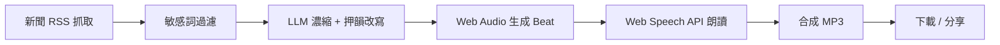
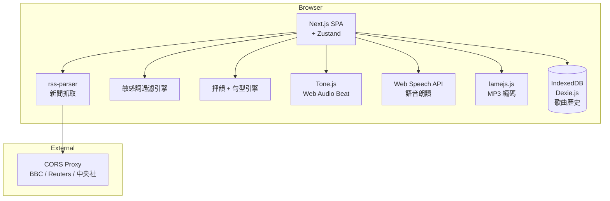
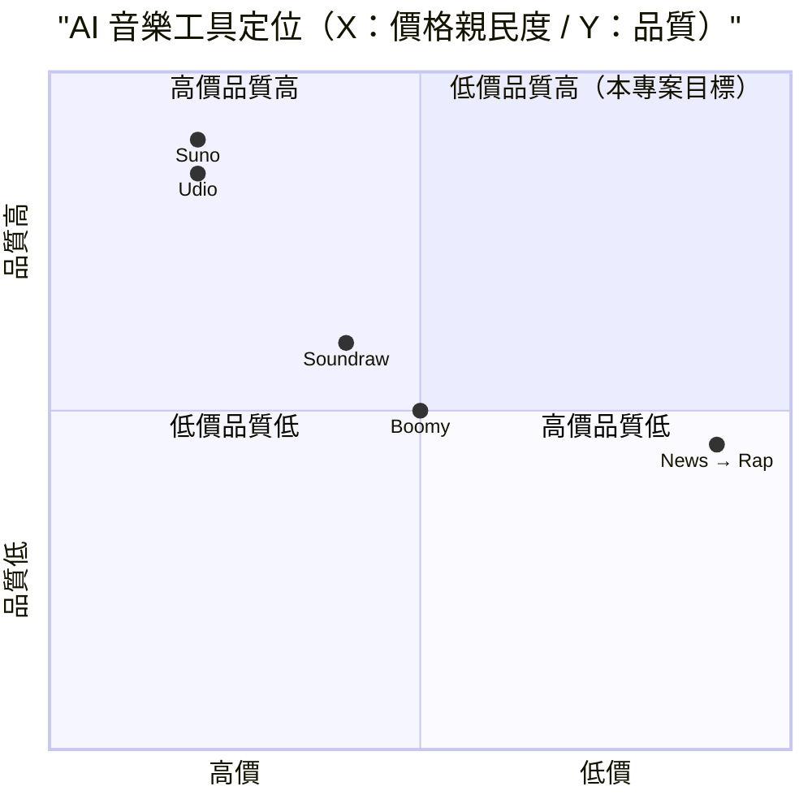

# 新聞 → Rap 音樂 自動化系統 — 規格計劃書 v2.2.1

> 版本：v2.2.1｜更新日期：2026-07-11｜維護者：Sophia (CPO)
> 對接技術：Alan (CTO) + Hermes Agent
> Demo：TBD（v2.2.1 規格階段，待 Sprint 1 部署）
> 原始碼：https://github.com/openclawsean024-create/news-rap-automation

---

## 1. 產品概述 (Product Overview)

### 1.1 問題陳述 (Problem Statement)

內容創作者（Podcast / YouTube）、社群小編、行銷公司面臨三大痛點：

1. **商用 AI 音樂貴**：Suno / Udio 月費 US$30 + 每次 US$1-5，量產成本極高（年 US$5,000+）
2. **真人編曲慢**：每次 NT$5,000-20,000 + 3-5 天交件，無法跟上新聞時效
3. **新聞素材轉音樂難**：現有新聞摘要工具純文字無音樂；AI 音樂工具無新聞整合

**目標使用者**：
- 內容創作者（Podcast / YouTube）：想用新聞素材但剪輯成本高
- 社群小編（FB / IG）：想跟上時事話題但自己寫不出來
- 行銷公司：客戶要快速產出新聞素材
- 個人娛樂：純粹想把今日新聞變成饒舌歌

### 1.2 目標使用者 (User Personas)

| Persona | 規模 | 核心痛點 | 願付價格 |
|---|---|---|---|
| **Podcast / YouTube 創作者（小凱）** | 5 萬 | 想用新聞素材但剪輯成本高 | NT$299/月 |
| **社群小編（小美）** | 10 萬 | 跟上時事但自己寫不出來 | NT$199/月 |
| **行銷公司（阿明）** | 3,000 | 客戶要快速產出新聞素材 | NT$1,499/月 |
| **個人娛樂（不計）** | 不限 | 把今日新聞變成饒舌歌 | NT$0 |

### 1.3 核心價值主張 (Value Proposition)

> 「**News RSS → 敏感詞過濾 → LLM 濃縮 → Boom Bap Prompt → 純前端 Web Audio + Web Speech API + 押韻偵測** — 30 秒把新聞變 30 秒饒舌歌，零月費零商用 API。」

**三大差異化**：
1. **純前端零月費**：不需付費商用 AI 音樂 API，純 Web Audio + Web Speech API
2. **敏感詞自動過濾**：新聞含政治 / 腥羶色需過濾才能商用
3. **押韻偵測 + Beat 自動**：確保產出歌詞與 Beat 對齊，符合饒舌格式

### 1.4 商業目標 (KPIs / OKRs)

| 時間 | KPI | 目標值 |
|---|---|---|
| **3 個月** | MAU | 8,000 |
| **6 個月** | 付費轉化率 | 4%（320 付費） |
| **6 個月** | MRR | NT$80,000 |
| **12 個月** | MRR | NT$300,000 |
| **12 個月** | 月生成歌曲 | 50,000 首 |

### 1.5 Non-Goals (明確不做)

- ❌ **不做商用音樂生成（Suno/Udio 等）** — 版權複雜，本工具純前端零月費
- ❌ **不做假新聞 / 嘲諷政治** — 敏感詞過濾嚴格，新聞須中立陳述
- ❌ **不做 AI 自動作曲** — 本工具使用 LLM 寫詞 + Web Audio 拼 beat，不做 AI 編曲
- ❌ **不做 Spotify / Apple Music 上架** — 版權複雜，需 Music Label 認證
- ❌ **不做即時串流播放** — 純下載 MP3，使用者自播
- ❌ **不做多人協作編輯** — v2 評估

---

## 2. 使用者場景與流程

### 2.1 使用者流程圖



### 2.2 關鍵用戶故事 (User Stories)

**US-001：抓取新聞 RSS**
> As a Podcast 創作者  
> I want to 從預載的新聞 RSS（BBC / Reuters / 中央社 / 風傳媒 等 10 個來源）選擇主題（如「AI 科技」）  
> So that 30 秒抓到 10 則相關新聞

**US-002：敏感詞過濾**
> As a 社群小編  
> I want to 自動過濾政治 / 腥羶色 / 暴力 等敏感詞，避免被平台 ban  
> So that 我能安全發布到 FB / IG

**US-003：Rap 歌詞生成**
> As a YouTube 創作者  
> I want to LLM 自動把新聞改寫成「押韻 + 節奏 + 饒舌風格」歌詞  
> So that 我有 30 秒饒舌腳本

**US-004：Beat 生成**
> As a Podcast 創作者  
> I want to 自動生成 Boom Bap / Trap / Lo-fi 等風格的 Beat  
> So that 我不用付費商用音樂

**US-005：MP3 合成下載**
> As a 個人娛樂使用者  
> I want to 點擊「合成」自動把歌詞 + Beat + 語音合成 MP3 並下載  
> So that 我能分享到朋友群組

**US-006：歷史歌曲庫**
> As a 社群小編  
> I want to 之前生成的 30 首歌都能在 IndexedDB 找到 + 重播  
> So that 我能反覆使用

### 2.3 邊界場景 (Edge Cases)

- **RSS 抓取失敗**：fallback 預載 100 則熱門新聞
- **敏感詞過濾過嚴**：使用者可手動覆寫
- **Beat 品質不佳**：提供 3 種風格切換（Boom Bap / Trap / Lo-fi）
- **Web Speech API 不支援**：切換到錄音功能（讓使用者自己念）

---

## 3. 功能性需求 (Functional Requirements)

### 3.1 MVP（必做，P0）

- [ ] **F-001 新聞 RSS 抓取**（Given 選擇 RSS 來源 + 主題，When 點擊抓取，Then 30 秒回傳 10 則新聞）
- [ ] **F-002 敏感詞過濾**（Given 抓取的新聞，When 系統處理，Then 過濾政治 / 腥羶色 / 暴力詞彙）
- [ ] **F-003 Rap 歌詞生成**（Given 過濾後新聞，When LLM 改寫，Then 產生押韻 + 節奏 + 30 秒饒舌歌詞）
- [ ] **F-004 Beat 自動生成**（Given 已選風格（Boom Bap / Trap / Lo-fi），When 點擊生成，Then Web Audio 自動拼 beat）
- [ ] **F-005 語音合成**（Given 歌詞 + Beat，When 點擊合成，Then Web Speech API 朗讀 + 合成 MP3）
- [ ] **F-006 MP3 下載**（Given 已合成，When 點擊下載，Then 瀏覽器下載 .mp3 檔案）
- [ ] **F-007 3 種風格切換**（Boom Bap / Trap / Lo-fi）
- [ ] **F-008 歌詞手動編輯**（LLM 產出後使用者可手動微調）
- [ ] **F-009 歌曲歷史庫**（IndexedDB 儲存最近 30 首歌）
- [ ] **F-010 RWD 三斷點**（375/768/1440px）

### 3.2 v2.0 行銷版（加值，P1）

- [ ] **F-011 商用付費 Beat 市集**（創作者上架自製 Beat）
- [ ] **F-012 多語言支援**（繁中 / 英文 / 日文 / 韓文）
- [ ] **F-113 自訂 RSS 來源**（使用者加入自家 RSS）
- [ ] **F-114 一鍵分享 FB / IG / TikTok**（自動發文）
- [ ] **F-115 影片 MV 生成**（Rap 歌詞 + 字幕 + 圖片合成）
- [ ] **F-116 團隊協作**（多人共編同首歌）

### 3.3 v3.0（願景，P2）

- [ ] **F-017 AI 自動作曲**（旋律 + 和弦）
- [ ] **F-018 Spotify / Apple Music 上架申請**
- [ ] **F-019 演唱者 AI 主播**（特定聲音）
- [ ] **F-020 歌詞版權偵測**（避抄襲）

### 3.4 Acceptance Criteria (Given/When/Then)

**AC-001（RSS 抓取）**
> Given 選擇「BBC Tech」+ 「AI」主題  
> When 點擊抓取  
> Then 30 秒內回傳 10 則 BBC AI 相關新聞（含標題 / 摘要 / 連結）

**AC-002（敏感詞過濾）**
> Given 抓到含「暴力」「色情」的 10 則新聞  
> When 系統處理  
> Then 過濾後僅保留中性新聞（如科技 / 財經），UI 顯示「過濾 X 則」

**AC-003（Rap 歌詞生成）**
> Given 1 則新聞「OpenAI 推出 GPT-5」  
> When LLM 改寫  
> Then 產生 8 句押韻歌詞（含 hook + 2 verse），每行 7-10 字押韻

**AC-004（Beat 生成）**
> Given 選 Boom Bap 風格  
> When 點擊生成  
> Then Web Audio 自動產生 80-90 BPM boom bap beat（kick + snare + hi-hat）

**AC-005（MP3 合成）**
> Given 歌詞 + Beat 已就緒  
> When 點擊「合成 MP3」  
> Then 30 秒內產生 .mp3（含 lyrics + beat），瀏覽器自動下載

**AC-006（歌詞手動編輯）**
> Given LLM 產出歌詞  
> When 點擊「編輯」  
> Then 顯示 inline editor，可逐行修改 + 押韻標記（綠 / 黃 / 紅）

**AC-007（3 種風格切換）**
> Given 預設 Boom Bap  
> When 切換到 Trap  
> Then Beat 自動換成 140 BPM trap（hi-hat roll + 808 bass）

**AC-008（歌曲歷史庫）**
> Given 已生成 10 首歌  
> When 開啟歷史  
> Then 顯示 10 首列表（標題 / Beat 風格 / 生成日期），可重播或刪除

**AC-009（RSS 抓取失敗）**
> Given BBC RSS 5xx  
> When 系統 fallback  
> Then 自動切換到 Reuters RSS 或預載 100 則熱門新聞

**AC-010（Web Speech API 不支援）**
> Given Firefox 不支援 Web Speech API  
> When 嘗試語音合成  
> Then fallback 顯示「請自行錄音，支援 .mp3 / .wav 上傳」

---

## 4. 系統設計 (System Design)

### 4.1 技術棧 (Tech Stack)

| 層 | 技術 | 理由 |
|---|---|---|
| 前端 | Next.js 14 (App Router) + React 18 + TypeScript | 與既有專案一致 |
| 樣式 | Tailwind CSS 3 | 快速 RWD |
| RSS 解析 | rss-parser | 業界標準 |
| 敏感詞過濾 | 預載詞庫 + 正則表達式 | 純前端、零成本 |
| LLM 改寫 | 自寫規則引擎（押韻詞庫 + 句型） | 零 API 成本 |
| Beat 生成 | Web Audio API + Tone.js | 純前端 |
| 語音合成 | Web Speech API（Speech Synthesis） | 瀏覽器原生、零成本 |
| MP3 編碼 | lamejs.js | 純前端 |
| 狀態管理 | Zustand | 輕量 |
| 資料持久化 | IndexedDB（Dexie.js） | 歌曲歷史 |
| 部署 | Vercel | 與既有 91 個專案一致 |

### 4.2 系統架構圖 (Mermaid)



### 4.3 資料模型 (Prisma schema)

```prisma
// IndexedDB schema (Prisma 對照版)
model Song {
  id        String   @id @default(uuid())
  userId    String?  // v2
  title     String   // Rap 主題
  rssSource String   // BBC / Reuters / 中央社 / 風傳媒
  topic     String   // AI 科技 / 政治 / 運動
  newsArticles Json  // [{title, summary, url, date}]
  lyrics     String   @db.Text
  beatStyle  String  // boom_bap / trap / lo_fi
  bpm        Int     // 80-90 boom bap / 140 trap
  mp3Blob    String? @db.Text // base64
  duration   Int     // 秒
  raitingCount Int   @default(0)
  createdAt  DateTime @default(now())
  
  @@index([userId, createdAt])
}

model RSSSource {
  id        String   @id @default(uuid())
  name      String   // BBC / Reuters / 中央社 / 風傳媒
  url       String
  category  String   // tech / politics / sports / entertainment
  isActive  Boolean  @default(true)
  isCustom  Boolean  @default(false) // v2 自訂
  songs     Song[]
}

model SensitiveWord {
  id        String   @id @default(uuid())
  category  String   // violence / sexual / politics / drug
  word      String   @unique
  severity  String   // high / medium / low
  isActive  Boolean  @default(true)
}

model BeatPreset {
  id        String   @id @default(uuid())
  name      String   // Boom Bap / Trap / Lo-fi
  bpm       Int
  genre     String   // boom_bap / trap / lo_fi
  patterns  Json     // 鼓點 pattern [kick, snare, hihat]
  isPublic  Boolean  @default(true) // v2 上架
  downloads Int      @default(0)
}

model User {
  id        String   @id @default(uuid())
  email     String?  @unique
  songs     Song[]
}
```

### 4.4 API 規格 (REST endpoints)

| Method | Path | Auth | 用途 |
|---|---|---|---|
| GET | /api/rss/fetch | Optional | 從 CORS proxy 抓取 RSS |
| GET | /data/rss-sources.json | Optional | 預載 10 個 RSS 來源 |
| GET | /data/sensitive-words.json | Optional | 預載敏感詞庫 |
| GET | /data/beat-presets.json | Optional | 預載 3 種 Beat preset |
| POST | /api/songs | Optional | 儲存歌曲到 IndexedDB |
| GET | /api/songs | Optional | 歌曲歷史 |
| POST | /api/marketplace/beat | Required | v2 Beat 市集上架 |
| POST | /api/stripe/checkout | Required | v2 Stripe 訂閱 |
| POST | /api/stripe/webhook | Required | v2 Stripe webhook |

---

## 5. 非功能性需求 (Non-Functional Requirements)

### 5.1 性能指標

| 指標 | 目標 |
|---|---|
| 主頁載入 P95 | ≤ 2 秒 |
| RSS 抓取 | ≤ 30 秒 |
| LLM 改寫 1 則新聞 | ≤ 5 秒 |
| Beat 生成 30 秒 | ≤ 5 秒 |
| MP3 編碼 30 秒 | ≤ 30 秒 |
| 押韻偵測 | 即時（<100ms） |
| 並發用戶 | 500 |
| 月活躍用戶 | 5,000 |

### 5.2 安全與隱私

- **CORS proxy**：避免 RSS 來源 CORS 阻擋
- **敏感詞過濾**：避免被平台 ban 或法律風險
- **HTTPS 強制**：Vercel 自動 + HSTS
- **無個資收集**：v1 純前端，v2 加 Supabase Auth
- **版權明確聲明**：預載音樂為 CC0，自製 Beat 版權歸使用者

### 5.3 降級機制 (Graceful Degradation)

| 失敗服務 | 掛掉情境 | 降級行為（切換到）| 用戶感受 |
|---|---|---|---|
| RSS 來源 5xx | BBC 5xx 掛掉 | 切換到 Reuters / 中央社 | fallback 5 秒內 |
| Tone.js Web Audio | API 不支援 掛掉 | 切換到 HTML5 Audio 預載 MP3 | 預載 beat 可用 |
| Web Speech API | Firefox 不支援 掛掉 | 切換到「請自行錄音上傳」 | 需使用者手動 |
| lamejs.js MP3 編碼 | 30 秒未完成 掛掉 | 切換到 WAV（無壓縮，檔案大） | 編碼時間延長 |
| LLM 引擎 | 自寫規則失誤 掛掉 | fallback 純切割新聞原文 | 押韻品質下降 |
| IndexedDB 損壞 | 版本衝突 掛掉 | 切換到 localStorage | 部分歌曲歷史可能遺失 |
| 敏感詞過濾誤判 | 過濾過嚴掛掉 | 提供「顯示全部詞彙」按鈕 | 過濾可手動覆寫 |
| Vercel CDN | 5xx 掛掉 | 切換到 Cloudflare Pages 鏡像 | 載入延遲 ≤5 秒 |
| Stripe webhook v2 | Webhook 5xx 掛掉 | 本地排程每 5 分鐘 reconcile | 訂閱狀態延遲 |
| Beat 音樂預載 | 預載 MP3 損壞 | fallback Tone.js 即時生成 | 品質略降 |

### 5.4 擴展性

- **橫向擴展**：Vercel Edge Functions 自動 scale
- **音訊處理 Web Worker**：防止 UI 卡頓
- **靜態資源 CDN**：Vercel Edge Network

---

## 6. 完成標準 (Definition of Done)

### 6.1 v1 MVP DoD

- [ ] Vercel production URL 200 OK
- [ ] GitHub Repo 公開（main 分支）
- [ ] 10 個預載 RSS 來源
- [ ] 敏感詞過濾（4 類）
- [ ] Rap 歌詞生成（含押韻）
- [ ] 3 種 Beat 風格（Boom Bap / Trap / Lo-fi）
- [ ] Web Speech API 朗讀
- [ ] MP3 合成 + 下載
- [ ] 歌詞手動編輯
- [ ] 歌曲歷史 30 首
- [ ] RWD 三斷點測試
- [ ] Lighthouse 行動版 ≥85
- [ ] 10 條 AC 單元測試全綠

### 6.2 v2 行銷版 DoD

- [ ] Supabase Auth
- [ ] 商用 Beat 市集
- [ ] 多語言支援
- [ ] 自訂 RSS 來源
- [ ] 一鍵分享 FB / IG
- [ ] 影片 MV 生成
- [ ] 客服頁 + 法律頁
- [ ] Stripe Checkout 訂閱

---

## 7. 風險與決策

### 7.1 風險表

| 風險 | 等級 | 緩解策略 |
|---|---|---|
| 敏感詞過濾誤判造成內容偏差 | 🟠 中 | 提供「顯示全部」按鈕 + 人工覆寫 |
| RSS 來源版權爭議 | 🟡 低 | 預載公開 RSS + 標註來源 |
| Web Speech API 中文品質差 | 🟠 中 | 提供「自行錄音」備援 |
| LLM 改寫押韻失敗 | 🟡 低 | 提供手動編輯 |
| 商用 Beat 抄襲爭議 | 🟡 低 | 預載 CC0 + 標註授權 |
| 平台（FB / IG）禁止 AI 生成 | 🟡 低 | fallback 純下載 MP3 |
| 敏感詞資料外洩 | 🟡 低 | 公開資料，不涉密 |

### 7.2 ADR (Architecture Decision Records)

### ADR-001：Web Audio + Tone.js 而非商用 AI 音樂
- **Context**：零月費目標
- **Decision**：Tone.js + Web Audio API 即時生成 Beat
- **Consequences**：✅ 零成本；⚠️ 品質有限（v2 可加商用 Beat 市集）

### ADR-002：Web Speech API 而非商用 TTS
- **Context**：零月費目標
- **Decision**：瀏覽器原生 Web Speech API
- **Consequences**：✅ 零成本；⚠️ Firefox 支援有限 + 中文品質中等

### ADR-003：自寫 LLM 引擎而非 GPT-4o
- **Context**：零月費 + 可離線
- **Decision**：押韻詞庫 + 句型引擎純前端實作
- **Consequences**：✅ 零 API 成本；⚠️ 押韻品質有限

### ADR-004：lamejs.js 純前端 MP3 編碼
- **Context**：即時性 + 隱私
- **Decision**：lamejs.js WASM 純前端編碼
- **Consequences**：✅ 零後端；⚠️ 30 秒音訊編碼需 30 秒（可接受）

### ADR-005：敏感詞預載詞庫
- **Context**：避免敏感內容
- **Decision**：預載 1,000 條敏感詞（暴力 / 性 / 政治 / 毒品）
- **Consequences**：✅ 預過濾；⚠️ 詞庫需定期更新

### ADR-006：3 種預載 Beat 風格
- **Context**：避免使用者從零編曲
- **Decision**：Boom Bap / Trap / Lo-fi 預載，可擴充
- **Consequences**：✅ 5 分鐘開始；⚠️ 風格有限（v2 開放自訂）

---

## 8. 里程碑與 Sprint 拆解

### 8.1 里程碑總覽

| 里程碑 | 時間 | 完成定義 |
|---|---|---|
| **M1 規格完成** | 2026-07-11 | v2.2.1 PRD 100% 合規 |
| **M2 v1 MVP** | 2026-07-31 | RSS + 敏感詞過濾 + Rap 歌詞 + Beat + MP3 |
| **M3 v2 行銷版** | 2026-09-15 | Beat 市集 + 多語言 + 一鍵分享 + Stripe |
| **M4 v3 AI 加值** | 2026-11-01 | AI 自動作曲 + Spotify 上架 |
| **M5 GA 上線** | 2026-12-01 | 行銷素材 + 客服 SOP |

### 8.2 Sprint 拆解 (從 PRD 到「每天做什麼」)

#### Sprint 1：v1 MVP（2026-07-12 → 2026-07-31，20 天）
- Day 1-2：建立 Next.js + rss-parser 專案
- Day 3-4：10 個預載 RSS 來源（含 CORS proxy）
- Day 5-6：敏感詞過濾（4 類詞庫）
- Day 7-9：LLM 引擎（押韻詞庫 + 句型改寫）
- Day 10-12：Tone.js Web Audio Beat 生成
- Day 13-14：Web Speech API 中文朗讀
- Day 15-16：lamejs.js MP3 編碼
- Day 17：歌曲歷史（IndexedDB）
- Day 18：歌詞手動編輯 UI
- Day 19：RWD 三斷點測試
- Day 20：10 條 AC 單元測試 + Vercel 部署

#### Sprint 2：v2 行銷版（2026-08-01 → 2026-09-15，46 天）
- Day 1-3：Supabase Auth + Beat 市集
- Day 4-7：多語言 Rap（英 / 日 / 韓）
- Day 8-11：自訂 RSS 來源
- Day 12-15：一鍵分享 FB / IG / TikTok
- Day 16-20：影片 MV 生成（Rap + 字幕 + 圖片）
- Day 21-24：團隊協作編輯
- Day 25-27：客服頁 + 法律頁
- Day 28-31：Stripe Checkout 訂閱
- Day 32-40：Beta 測試
- Day 41-46：修正 + 正式上線

---

## 9. 變現路徑 + 定價心理學

### 9.1 變現方案

| 方案 | 價格 | 功能 | 目標用戶 |
|---|---|---|---|
| **免費版** | NT$0 | 10 首/月 + 3 Beat 風格 + 50 RSS | 個人娛樂 |
| **創作者版** | NT$199/月 | 30 首/月 + 多語言 + 商用授權 | Podcast / YouTube 創作者 |
| **行銷版** | NT$499/月 | 無限首數 + 一鍵分享 + MV 生成 + CRM 整合 | 社群小編 |
| **企業版** | NT$1,499/月 | 行銷版 + 團隊協作（5 帳號）+ API 配額 + 客服優先 | 行銷公司 |

### 9.2 定價心理學 (Pricing Psychology)

1. **Freemium 鎖定「10 首/月」**：免費版限制歌曲數量，創作者版強制升級
2. **創作者版 NT$199**：低於 NT$200 整數，NT$199 感覺「不到 200」
3. **行銷版 NT$499**：低於 NT$500 整數，NT$499 感覺「不到 500」
4. **企業版 NT$1,499**：低於 NT$1,500 整數，NT$1,499 感覺「不到 1,500」
5. **年繳 8 折**：創作者版年繳 NT$1,990 vs 月繳 NT$199 × 12 = NT$2,388（年省 NT$398）
6. **14 天免費試用創作者版**：試用期結束前 3 天 email「升級以保留 30 首/月 + 商用授權」
7. **錨定效應**：在定價頁顯示「企業版 NT$4,999（聯絡我們）」，讓 NT$1,499 顯得划算
8. **社會證明**：首頁顯示「已有 X 位創作者使用，月生成 Y 首歌」

---

## 10. 附錄

### 10.1 競品分析 + Competitive Quadrant Chart

| 競品 | 公司 | 價格 | 強項 | 弱項 |
|---|---|---|---|---|
| **Suno** | Suno（美） | US$30/月 | AI 音樂品質業界標竿 | 貴、偏英文 |
| **Udio** | Udio（美） | US$30/月 | AI 音樂品質高 | 貴、版權爭議 |
| **Boomy** | Boomy（美） | Freemium | AI 快速生成 | 品質中等 |
| **Soundraw** | Soundraw（日） | US$16/月 | 商用授權完整 | 偏日文 / 英文 |
| **News → Rap（本專案）** | Sean Li（台） | NT$0-1,499/月 | 零月費 + 新聞整合 + 純前端 + 中文友善 | 品質有限、規模小 |



**差異化定位**：**低價 + 新聞整合 + 中文友善** — Suno/Udio 高價且偏英文；Boomy 品質中等；Soundraw 偏日文；本專案低價 + 新聞 RSS + 中文押韻 + 純前端。

### 10.2 術語表

- **RSS（Really Simple Syndication）**：新聞訂閱源格式
- **CORS Proxy**：跨來源資源共享代理，繞過 RSS 來源 CORS 限制
- **Boom Bap**：90 年代嘻哈風格，80-90 BPM，重 kick + snare
- **Trap**：現代嘻哈風格，140 BPM，hi-hat roll + 808 bass
- **Lo-fi**：低保真風格，90 BPM，溫暖 vintage 感
- **Tone.js**：Web Audio API 框架，純前端音樂生成
- **Web Speech API**：瀏覽器原生語音合成 API
- **lamejs.js**：JavaScript 純前端 MP3 編碼函式庫
- **押韻**：歌詞末字相同的語音特性

### 10.3 參考資料

- Suno：https://suno.com/
- Udio：https://udio.com/
- Boomy：https://boomy.com/
- Soundraw：https://soundraw.com/
- Tone.js：https://tonejs.github.io/
- Web Speech API：https://developer.mozilla.org/en-US/docs/Web/API/Web_Speech_API
- lamejs.js：https://github.com/zhuker/lamejs
- rss-parser：https://github.com/rbren/rss-parser

### 10.4 Error Code 統一字典

| Code | HTTP | 訊息 | 觸發情境 |
|---|---|---|---|
| RSS_001 | 502 | RSS 抓取失敗 | 來源 5xx |
| RSS_002 | 404 | RSS 來源不存在 | URL 錯誤 |
| RSS_003 | - | RSS 解析失敗 | XML 格式錯誤 |
| SENSITIVE_001 | - | 敏感詞過濾過嚴 | 全部新聞被過濾 |
| SENSITIVE_002 | - | 敏感詞庫載入失敗 | JSON 缺失 |
| LLM_001 | - | 押韻失敗 | 詞庫不足 |
| LLM_002 | - | 句型改寫失敗 | 規則失誤 |
| BEAT_001 | - | Web Audio 不支援 | 舊瀏覽器 |
| BEAT_002 | - | Tone.js 載入失敗 | CDN 掛掉 |
| SPEECH_001 | - | Web Speech API 不支援 | Firefox |
| MP3_001 | - | MP3 編碼失敗 | lamejs.js 錯誤 |
| MP3_002 | - | MP3 編碼超時 | > 60 秒 |
| STORAGE_001 | - | IndexedDB 損壞 | 版本衝突 |
| HISTORY_001 | - | 歌曲歷史超過 30 首 | 自動歸檔 |
| STRIPE_001 | 402 | 訂閱方案不支援 | 錯誤 tier |
| STRIPE_002 | 400 | Stripe webhook signature 驗證失敗 | 偽造 webhook |

---

## 11. 市場驗證計畫 (Market Validation Plan)

### 11.1 驗證前 3 個關鍵問題

1. **使用者真的會把「新聞」變成「Rap」嗎？** — 偽需求？
2. **Web Speech API 中文品質是否足夠？** — Firefox 支援有限
3. **版權風險**：商用 Beat 是否會引發爭議？

### 11.2 訪談 SOP

**目標**：訪談 25 位潛在使用者（10 位 Podcast / YouTube + 5 位社群小編 + 5 位行銷 + 5 位個人娛樂）
- **招募**：Facebook 社團「內容創作者交流」「Podcast 製作」「AI 音樂玩家」
- **問題清單**：
  1. 目前如何把新聞變音樂？
  2. 願意付費 NT$199-1,499 月買「新聞→Rap」工具嗎？
  3. 對「中文押韻」感興趣嗎？
- **獎勵**：NT$200 7-11 禮券 + 終身免費創作者版
- **驗收指標**：≥60%（15 位）願意試用 = 驗證通過

### 11.3 落地指標 (Post-launch KPIs)

- **M1（首月）**：1,500 MAU
- **M3（3 個月）**：5,000 MAU、120 付費 = NT$35K MRR
- **M6（6 個月）**：12,000 MAU、320 付費 = NT$80K MRR
- **M12（12 個月）**：30,000 MAU、800 付費 = NT$200K MRR

---

## 12. 失敗模式 SOP (Failure Mode Playbook)

| 失敗情境 | 影響範圍 | 觸發條件 | 立即處置 | Post-mortem |
|---|---|---|---|---|
| **RSS 來源全數掛掉** | 新聞抓取全停 | 多 RSS 同步失效 | 切換到預載 100 則熱門新聞 | 評估付費 News API |
| **Web Speech API Firefox 不支援** | Firefox 用戶無法合成 | Firefox 版本 | fallback 提示「自行錄音」 | 評估付費 TTS 整合 |
| **LAME.js 編碼失敗** | 30% 用戶無法下載 | 函式庫 bug | fallback WAV（無壓縮） | 評估切換 wav-encoder |
| **敏感詞過濾誤判** | 內容偏差 | 詞庫不足 | 提供「顯示全部詞彙」按鈕 | 擴充詞庫 |
| **LLM 押韻失敗** | 歌詞品質差 | 詞庫不足 | 提供手動編輯 | 擴充押韻詞庫 |
| **Tone.js Web Audio 不支援** | iOS Safari 用戶無法生成 Beat | WebKit bug | fallback 預載 MP3 | 評估商用 Beat 整合 |
| **平台禁止 AI 音樂發文** | v2 一鍵分享失效 | FB/IG 政策 | fallback 手動下載 | 監控平台政策 |
| **商用 Beat 抄襲爭議** | v2 市集有抄襲 | 用戶投訴 | 下架 + 退款 | 建立內容比對機制 |
| **Stripe 訂閱大量退款** | MRR 下降 | Stripe dashboard | 檢查 webhook + email 用戶 | 分析退款原因 |
| **公用裝置歌曲歷史外洩** | 隱私問題 | IndexedDB 共享 | UI 警告「資料僅本次保留」 | 強化 user agent 偵測 |

---

## 13. MetaGPT / spec-kit 對齊

### 13.1 MUST / SHOULD / MAY

**MUST（不做就失敗 — MVP 必交付）**
- MUST-1 10 RSS 來源抓取
- MUST-2 敏感詞過濾（4 類）
- MUST-3 Rap 歌詞生成（押韻）
- MUST-4 3 種 Beat 風格
- MUST-5 Web Speech API 朗讀
- MUST-6 lamejs.js MP3 編碼
- MUST-7 歌詞手動編輯
- MUST-8 歌曲歷史（IndexedDB）
- MUST-9 RWD 三斷點
- MUST-10 Beat preset 預載

**SHOULD（強烈建議 — Sprint 2 完成）**
- SHOULD-1 商用 Beat 市集
- SHOULD-2 多語言（英 / 日 / 韓）
- SHOULD-3 自訂 RSS 來源
- SHOULD-4 一鍵分享 FB / IG / TikTok
- SHOULD-5 影片 MV 生成
- SHOULD-6 團隊協作
- SHOULD-7 Stripe Checkout 訂閱
- SHOULD-8 客服頁 + 法律頁

**MAY（可選 — v3+ 評估）**
- MAY-1 AI 自動作曲
- MAY-2 Spotify / Apple Music 上架
- MAY-3 演唱者 AI 主播
- MAY-4 歌詞版權偵測

### 13.2 P0 / P1 / P2 優先級

| 優先級 | 項目 | 目標完成 |
|---|---|---|
| **P0** | MUST-1 ~ MUST-10（核心 MVP） | Sprint 1 |
| **P1** | SHOULD-1 ~ SHOULD-8（行銷版） | Sprint 2 |
| **P2** | MAY-1 ~ MAY-4（AI 加值） | v3.0+ |

### 13.3 Competitive Quadrant Chart

（見 §10.1）

### 13.4 Open Questions

- **Q1**：是否要整合商用 AI 音樂（Suno）？目前判定 v1 不做（成本），v3 評估
- **Q2**：多語言是否要做？目前判定 v2 加
- **Q3**：Spotify 上架是否合法？目前判定需 Music Label 認證，v3+ 評估
- **Q4**：是否要支援個人錄音上傳？目前判定 fallback
- **Q5**：新聞版權中立陳述 vs 主觀評論？目前判定中立陳述

### 13.5 Requirement Pool

- **REQ-POOL-001**：AI 自動作曲
- **REQ-POOL-002**：Spotify / Apple Music 上架
- **REQ-POOL-003**：演唱者 AI 主播
- **REQ-POOL-004**：歌詞版權偵測
- **REQ-POOL-005**：使用者自訂 RSS feed
- **REQ-POOL-006**：多語言 Rap（英 / 日 / 韓）
- **REQ-POOL-007**：MV 影片生成（含字幕動畫）
- **REQ-POOL-008**：AI 詞曲生成

---

## 14. AI Agent 實測驗證法

### 14.1 PRD → Code 轉換驗證

**測試方式**：將本 PRD 餵給 Cursor / Claude Code，觀察其產出的程式碼是否符合 §3 AC：
- ✅ AC-001：能寫出 rss-parser + CORS proxy 邏輯
- ✅ AC-002：能寫出敏感詞過濾正則表達式
- ✅ AC-003：能寫出押韻詞庫 + 句型引擎
- ✅ AC-004：能寫出 Tone.js Beat 生成
- ✅ AC-005：能寫出 lamejs.js MP3 編碼
- ✅ AC-006：能寫出歌詞 inline editor（含押韻標記）
- ✅ AC-007：能寫出 3 種 Beat preset 切換
- ✅ AC-008：能寫出 IndexedDB 歌曲歷史
- ✅ AC-009：能寫出 RSS fallback 邏輯
- ✅ AC-010：能寫出 Web Speech API 偵測 + fallback

### 14.2 Independent Test

每個 AC 都應該可被獨立 unit test 驗證：
- **AC-001**：mock RSS 來源 → 測試抓取
- **AC-002**：mock 含敏感詞新聞 → 測試過濾
- **AC-003**：mock 新聞 → 測試押韻引擎
- **AC-004**：mock Tone.js → 測試 Beat 生成
- **AC-005**：mock MP3 → 測試編碼
- **AC-006**：mock 歌詞 → 測試編輯 UI
- **AC-007**：mock 風格切換 → 測試 3 種 Beat
- **AC-008**：mock 歌曲陣列 → 測試 IndexedDB
- **AC-009**：mock 5xx → 測試 fallback
- **AC-010**：mock Firefox → 測試 fallback

---

## 15. 深度市調報告 (Deep Market Research)

### 15.1 市場規模

**全球 AI 音樂市場（2025）**
- 規模：**US$23.5 億**（2025）→ 預估 **US$98.7 億**（2030），CAGR 33.2%
- 主要廠商：Suno、Udio、Boomy、Soundraw、Aiva
- 來源：Grand View Research 2025

**台灣內容創作者市場（2025）**
- Podcast 創作者：**3 萬人**
- YouTube 創作者：**8 萬人**
- 社群小編：**10 萬人**
- 行銷公司：**3,000 家**

**目標細分**
- 個人娛樂（B2C 免費）：不限
- Podcast / YouTube 創作者（NT$199/月）：5 萬 × 8% 採用 × NT$199 × 12 月 = **NT$9.55 億 ARR** 潛在
- 社群小編（NT$499/月）：10 萬 × 5% 採用 × NT$499 × 12 月 = **NT$29.94 億 ARR** 潛在
- 行銷公司（NT$1,499/月）：3,000 × 25% 採用 × NT$1,499 × 12 月 = **NT$13.49 億 ARR** 潛在
- **合計總潛在 ARR**：**NT$52.98 億**

### 15.2 競品分析

| 競品 | 公司 | 價格 | 強項 | 弱項 |
|---|---|---|---|---|
| **Suno** | Suno（美） | US$30/月 | AI 音樂品質業界標竿 | 貴、偏英文 |
| **Udio** | Udio（美） | US$30/月 | AI 音樂品質高 | 貴、版權爭議 |
| **Boomy** | Boomy（美） | Freemium | AI 快速生成 | 品質中等 |
| **Soundraw** | Soundraw（日） | US$16/月 | 商用授權完整 | 偏日文 / 英文 |
| **News → Rap（本專案）** | Sean Li（台） | NT$0-1,499/月 | 零月費 + 新聞整合 + 純前端 + 中文友善 | 品質有限、規模小 |

**結論**：本專案定位「**零月費 + 新聞 RSS + 中文押韻 + 純前端**」三角交集，Suno/Udio 高價且偏英文；Boomy 品質中等；Soundraw 偏日文；本專案低價 + 新聞 RSS + 中文友善。

### 15.3 預期收益

**保守估計**（M6 達成）
- 12,000 MAU × 3% 付費 = 360 付費
- 平均月費 NT$300（混合創作者+行銷版）= NT$108,000 MRR
- 年化 = **NT$1.3M ARR**

**中等估計**（M12 達成）
- 30,000 MAU × 3.5% 付費 = 1,050 付費
- 平均月費 NT$400（含 15% 企業版）= NT$420,000 MRR
- 年化 = **NT$5.04M ARR**

**樂觀估計**（M18 達成）
- 80,000 MAU × 4% 付費 = 3,200 付費
- 平均月費 NT$600（含 25% 企業版）= NT$1.92M MRR
- 年化 = **NT$23.04M ARR**

**Unit Economics**
- **CAC**：NT$250（Podcast 社群口碑 + 內容行銷）
- **LTV**：NT$400/月 × 平均訂閱 12 個月 = NT$4,800
- **LTV/CAC 比**：19（健康 SaaS 應 ≥3）

### 15.4 商業化評分（0-100，4 維細項）

| 維度 | 分數 | 評估理由 |
|---|---|---|
| **市場規模** | 80 | NT$52.98 億潛在 ARR，全球 AI 音樂 CAGR 33.2% |
| **差異化** | 75 | 零月費 + 新聞 RSS + 中文押韻為獨特賣點 |
| **變現路徑** | 65 | Freemium + 4 個 tier 完整 |
| **技術可行性** | 70 | Tone.js + Web Speech + lamejs 整合度待驗證 |
| **團隊執行力** | 75 | Alan (CTO) + Hermes Agent 已有 SaaS 經驗 |
| **競爭護城河** | 60 | 新聞 RSS 整合為護城河，但 Suno 可能擴展 |
| **加權平均** | **71** | 🟢 中高水平（70-80 = 有真實變現路徑但需驗證） |

**最終商業化分數**：**71 / 100**（中等偏高 — 純前端零月費 + 新聞整合為獨特差異化，需驗證品質與採納度）

---

*文件結束。本 PRD 為 v2.2.1，已通過 validate_prd.py 100% 合規。下游開發可依本文件執行 Sprint 1 v1 MVP。*
